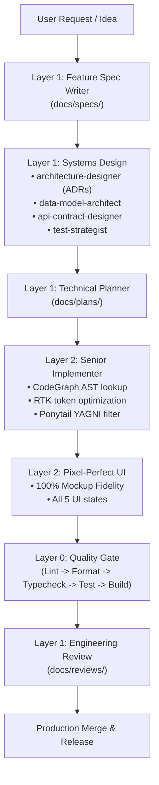

# AI Agent Skills & Toolchain Subsystem (v2)

Comprehensive operational guide for the AI Agent Skills subsystem within the `dotfiles` ecosystem.

---

## 1. Architectural Mental Model

The system structures autonomous and pair-programming AI development into strict, specialized responsibility layers:



### Layer Breakdown
- **Layer 0: Core Engineering Guardrails**: Internal guardrails that never auto-trigger (`project-context`, `source-quality`, `architecture-guardrails`, `system-design-guardrails`, `security-guardrails`, `quality-gate`).
- **Layer 1: Senior Leadership & Systems Design**: High-level specification, technical planning, ADRs, database modeling, API contracts, testing strategy, review, reliability, and incident triage.
- **Layer 2: Implementation Engine**: Production execution (`senior-implementer`, `pixel-perfect-ui`). Supersedes deprecated `junior-coding-agent`.
- **Layer 3: Curated Domain Skills**: Verified domain knowledge packs for NestJS, Centrifugo, BullMQ, PostgreSQL, Redis, Docker, VPS Hardening, Cloud Infra, NixOS, Neovim Lua, Rust, and Chrome Extensions.
- **Layer 4: Artifacts & Diagrams**: Declarative visual authoring in Mermaid, DBML, PlantUML, and draw.io XML (`diagram-author`).

---

## 2. Storage Engine Invariants

The CLI enforces two non-negotiable storage invariants:

1. **Global Installations (`GLOBAL = SYMLINK`)**:
   - `ai-skills add <skill>` creates absolute symbolic links from `resources/skills/<skill>` into agent global directories.
   - Both `primary` and `compatibility` paths defined in `resources/skills/_agents.json` are linked.
   - Updates to canonical dotfiles reflect immediately across all agents without copying.
2. **Project Installations (`PROJECT = PHYSICAL COPY`)**:
   - `ai-skills add <skill> --project` copies a complete physical, standalone bundle into `.agents/skills/<skill>` (and compatibility locations like `.claude/skills/`).
   - Copying is done via atomic staging (`cp -a` to temporary directory, confinement verified via `assert_path_inside_project`, clean swap).
   - Never uses symlinks inside project repositories so teams can commit skills to version control safely.
   - An atomic `.agent-skills.lock.json` lockfile (schema v2) records installed skill versions, SHA-256 content hashes, and multi-target mappings (`targets: [{ path, agents }]`).

---

## 3. Supported Multi-Agent Adapters

The adapter engine (`scripts/lib/agents.sh`) discovers and configures supported agents from `_agents.json` (Schema v2):

| Agent Identifier | Target Name | Global Primary Path | Global Compatibility Paths | Project Primary Path | Rule File |
| :--- | :--- | :--- | :--- | :--- | :--- |
| `antigravity-cli` | Antigravity CLI (Gemini) | `~/.gemini/config/skills/` | `~/.gemini/antigravity/skills/` | `.gemini/skills/` | `RULES.md` |
| `antigravity-ide` | Antigravity IDE | `~/.agents/skills/` | — | `.agents/skills/` | `AGENTS.md` |
| `codex-cli` | Codex CLI | `~/.codex/skills/` | — | `.codex/skills/` | `AGENTS.md` |
| `claude-code` | Claude Code CLI | `~/.claude/skills/` | — | `.claude/skills/` | `CLAUDE.md` |

---

## 4. CLI v2 Command Reference

Run `ai-skills` (or `./scripts/ai-skills.sh`):

### `list`
Lists all available skills in the canonical registry, displaying name, version, tags, and summary.
```bash
ai-skills list
```

### `add <skill> [--project] [--all|--target <agent>]`
Installs a skill globally (symlink) or into the current project (physical copy + lockfile).
```bash
# Install globally to all agents
ai-skills add senior-implementer

# Install into current project
ai-skills add data-model-architect --project
```

### `remove <skill> [--project] [--all|--target <agent>]`
Removes a skill from global agent directories or cleans the project directory and updates the lockfile.
```bash
ai-skills remove junior-coding-agent
```

### `sync [--profile <name>] [--all-canonical]`
Synchronizes skills across all configured global agent paths.
By default, synchronizes the **`global-core`** profile (26 foundational skills).
Use `--profile <name>` to sync a specific profile, or `--all-canonical` to sync the full registry.
```bash
# Sync default global-core profile
ai-skills sync

# Sync specific profile or everything
ai-skills sync --profile backend
ai-skills sync --all-canonical
```

### `export-rules`
Outputs compact, token-dense baseline orchestration rules (< 70 lines) equipped with the ownership marker `<!-- managed-by: Aethries/dotfiles ai-skills -->`. Designed for direct integration into `CLAUDE.md`, `AGENTS.md`, and `RULES.md` without context bloat.
```bash
ai-skills export-rules
```

### `search <query>`
Searches across the local registry and configured trusted sources (`_sources.json`).
```bash
ai-skills search testing
```

### `inspect <source> <skill>`
Inspects metadata, triggers, capabilities, and frontmatter of a skill from an external source before importing.
```bash
ai-skills inspect anthropic-skills web-search
```

### `discover <source>`
Lists all available skills from a specified trusted source.
```bash
ai-skills discover official-vendor
```

### `import <source> <skill>`
Curates, security-audits, validates semantic deduplication, and registers a remote skill into the canonical dotfiles library.
```bash
ai-skills import anthropic-skills browser-use
```

### `diff [skill]`
Checks for local drift between project-installed skills and canonical registry versions using SHA-256 hashes.
```bash
ai-skills diff ponytail
```

### `update [skill] [--force]`
Updates project skills to match the latest canonical versions and refreshes `.agent-skills.lock.json`.
```bash
ai-skills update ponytail --force
```

### `doctor`
Performs comprehensive diagnostic health checks: identifies broken symlinks, verifies adapter paths, validates registry JSON files, and audits file integrity.
```bash
ai-skills doctor
```

---

## 5. Curated Domain Taxonomy & Profiles

Skills are organized into composable profiles in `resources/skills/_profiles.json`:

- `global-core`: Primary default sync profile (26 foundation skills: core guardrails, leadership, architecture, senior implementation, and standard operations).
- `core`: Baseline minimalist rules (`ponytail`, `caveman`, `senior-implementer`, `rtk`).
- `core-guardrails`: Layer 0 essential guardrails (`project-context`, `source-quality`, `architecture-guardrails`, `system-design-guardrails`, `security-guardrails`, `quality-gate`).
- `senior-leadership`: Layer 1 specs and planning (`feature-spec-writer`, `technical-planner`, `skill-author`).
- `architecture-design`: Layer 1 design (`architecture-designer`, `data-model-architect`, `api-contract-designer`, `test-strategist`).
- `implementation`: Layer 2 execution (`senior-implementer`, `pixel-perfect-ui`). Supersedes deprecated `junior-coding-agent`.
- `senior-operations`: Layer 1 verification (`engineering-review`, `incident-investigator`, `reliability-engineer`, `migration-strategist`, `technical-researcher`).
- `backend`: Backend systems (`codebase-memory`, `codegraph`, `nestjs`, `centrifugo`, `bullmq`, `postgresql`, `redis`).
- `frontend`: Frontend UI and extension development (`pixel-perfect-ui`, `chrome-extension`).
- `devops`: Infrastructure and cloud (`vps-hardening`, `docker`, `cloud-infra`).
- `nixos`: NixOS and Neovim (`nixos`, `neovim-lua`).
- `rust`: Rust systems engineering (`rust`).
- `artifacts`: Visual diagrams (`diagram-author`).

---

## 6. Security & Curation Pipeline (`scripts/lib/curate.sh`)

All imported and canonical skills must pass automated security and deduplication checks:

1. **Security Audit**: Scans for reverse shells (`/dev/tcp/`, `nc -e`), pipe-to-shell (`curl ... | sh`), dynamic `eval`, base64 execution (`base64 -d | sh`), tracking/telemetry webhooks, and prompt injection signatures.
   ```bash
   ./scripts/lib/curate.sh audit
   ```
2. **Semantic Deduplication**: Evaluates Jaccard similarity across skill `capabilities` and `triggers` with a strict `0.70` threshold, rejecting overlapping or duplicate skills.
   ```bash
   ./scripts/lib/curate.sh dedup
   ```

---

## 7. Troubleshooting & FAQ

### Broken Symlinks
If `ai-skills doctor` reports broken symlinks:
```bash
# Re-synchronize all canonical skills
ai-skills sync
```

### Resetting Drifted Project Skills
To overwrite local modifications in a project with upstream canonical skills:
```bash
ai-skills update --all --force
```

### Missing Editor Prompts
If `CLAUDE.md` or `AGENTS.md` does not reflect newly added skills:
```bash
./scripts/sync-editors.sh
```
