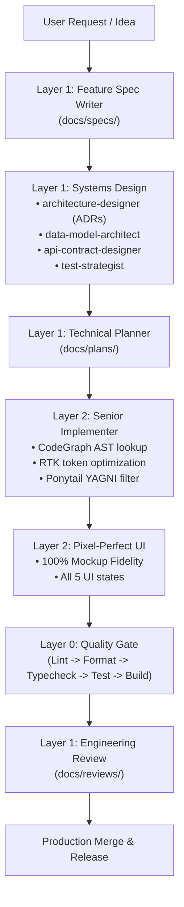

# AI Agent Skills & Toolchain Subsystem (v2)

Comprehensive operational guide for the AI Agent Skills subsystem within the `dotfiles` ecosystem.

---

## 1. Architectural Mental Model

The system structures autonomous and pair-programming AI development into strict, specialized responsibility layers:



### Layer Breakdown
- **Layer 0: Core Engineering Guardrails**: Internal guardrails that never auto-trigger (`project-context`, `source-quality`, `architecture-guardrails`, `system-design-guardrails`, `security-guardrails`, `quality-gate`).
- **Layer 1: Senior Leadership & Systems Design**: High-level specification, technical planning, ADRs, database modeling, API contracts, testing strategy, review, reliability, and incident triage.
- **Layer 2: Implementation Engine**: Production execution (`senior-implementer`, `pixel-perfect-ui`). Supersedes deprecated `junior-coding-agent`.
- **Layer 3: Curated Domain Skills**: Verified domain knowledge packs for NestJS, Centrifugo, BullMQ, PostgreSQL, Redis, Docker, VPS Hardening, Cloud Infra, NixOS, Neovim Lua, Rust, and Chrome Extensions.
- **Layer 4: Artifacts & Diagrams**: Declarative visual authoring in Mermaid, DBML, PlantUML, and draw.io XML (`diagram-author`).

---

## 2. Storage Engine Invariants

The CLI enforces two non-negotiable storage invariants:

1. **Global Installations (`GLOBAL = SYMLINK`)**:
   - `ai-skills add <skill>` creates absolute symbolic links from `resources/skills/<skill>` into agent global directories.
   - Both `primary` and `compatibility` paths defined in `resources/skills/_agents.json` are linked.
   - Updates to canonical dotfiles reflect immediately across all agents without copying.
2. **Project Installations (`PROJECT = PHYSICAL COPY`)**:
   - `ai-skills add <skill> --project` copies a complete physical, standalone bundle into `.agents/skills/<skill>` (and compatibility locations like `.claude/skills/`).
   - Copying is done via atomic staging (`cp -a` to temporary directory, confinement verified via `assert_path_inside_project`, clean swap).
   - Never uses symlinks inside project repositories so teams can commit skills to version control safely.
   - An atomic `.agent-skills.lock.json` lockfile (schema v2) records installed skill versions, SHA-256 content hashes, and multi-target mappings (`targets: [{ path, agents }]`).

---

## 3. Supported Multi-Agent Adapters

The adapter engine (`scripts/lib/agents.sh`) discovers and configures supported agents from `_agents.json` (Schema v2):

| Agent Identifier | Target Name | Global Primary Path | Global Compatibility Paths | Project Primary Path | Rule File |
| :--- | :--- | :--- | :--- | :--- | :--- |
| `antigravity-cli` | Google Antigravity CLI | `~/.gemini/config/skills/` | `~/.gemini/antigravity-cli/skills/` | `.agents/skills/` | `GEMINI.md` |
| `antigravity-ide` | Google Antigravity IDE | `~/.gemini/config/skills/` | `~/.agents/skills/` | `.agents/skills/` | `GEMINI.md` |
| `codex-cli` | OpenAI Codex CLI | `~/.agents/skills/` | `~/.codex/skills/` | `.agents/skills/` | `AGENTS.md` |
| `claude-code` | Anthropic Claude Code CLI | `~/.claude/skills/` | — | `.claude/skills/` | `CLAUDE.md` |

---

## 4. CLI v2 Command Reference

Run `ai-skills` (or `./scripts/ai-skills.sh`):

### `list`
Lists all available skills in the canonical registry, displaying name, version, tags, and summary.
```bash
ai-skills list
```

### `add [skill...] [--global <agent>] [--project [path]]`
Installs skills globally (symlink) or into a project (physical copy + lockfile).
Skill names are optional. When no names are supplied, the command opens the
existing interactive selector and then continues through the same add workflow
used by explicit names. Command-line options are parsed first, so the scope,
project path, and target agent remain in effect for the selected skills.

The selector enumerates canonical skill directories containing `SKILL.md`,
ignores metadata entries beginning with `_`, sorts names deterministically, and
supports multi-select with `fzf`. Without `fzf`, it uses the numbered fallback.
Pressing `Esc`, cancelling, or submitting no valid fallback selections exits
successfully without changing symlinks, project copies, or lockfiles.

Interactive examples:

```bash
# Select skills, then link them globally to all configured agents
ai-skills add

# Select skills, then install physical project copies for all project targets
ai-skills add --project

# Select skills, then link only into Codex's global target
ai-skills add --global codex-cli

# Select skills for a project path while preserving the existing project logic
ai-skills add --project ~/Workspaces/example
```

Explicit names remain non-interactive and use the same install semantics:

```bash
# Global installs are absolute symlinks to resources/skills/<name>
ai-skills add senior-implementer

# Project installs are physical copies and update .agent-skills.lock.json
ai-skills add data-model-architect --project

# Select the target agent explicitly
ai-skills add nestjs postgresql --global codex-cli
```

`--target <agent>` is an equivalent target selector. `--force`/`--replace`
and `--backup` retain their existing overwrite and backup semantics. Unknown
skill names still fail through the normal explicit add path.

### `remove <skill> [--project] [--all|--target <agent>]`
Removes a skill from global agent directories or cleans the project directory and updates the lockfile.
```bash
ai-skills remove junior-coding-agent
```

### `sync [--profile <name>] [--all-canonical]`
Synchronizes skills across all configured global agent paths.
By default, synchronizes the **`senior-global`** profile (16 lean senior baseline skills).
Use `--profile <name>` to sync a specific profile, or `--all-canonical` to sync the full registry.
```bash
# Sync default senior-global profile
ai-skills sync

# Sync specific profile or everything
ai-skills sync --profile backend
ai-skills sync --all-canonical
```

### `export-rules`
Outputs compact, token-dense baseline orchestration rules (< 70 lines) equipped with the ownership marker `<!-- managed-by: Aethries/dotfiles ai-skills -->`. Designed for direct integration into `CLAUDE.md`, `AGENTS.md`, and `RULES.md` without context bloat.
```bash
ai-skills export-rules
```

### `list`
Lists all available skills in the canonical registry, displaying name, version, tags, and summary.
```bash
ai-skills list
```

### `search <query>`
Searches across the local canonical library only. If no local skills match, provides immediate discovery guidance (`ai-skills discover <query>`).
```bash
ai-skills search redis
```

### `sources`
Lists trusted external skill sources and registries defined in `_sources.json`, including source types, trust levels, and curation policies.
```bash
ai-skills sources
```

### `discover <query> [--json]`
Discovers skills across trusted external providers (Official Vendor, Anthropic Skills, skills.sh, Agentic Awesome, GitHub topic search).
```bash
ai-skills discover nextjs
```

### `recommend [--project <path>]`
Audits high-signal project descriptors (`package.json`, `Cargo.toml`, `flake.nix`, `Dockerfile`, etc.) to detect tech stack and compare against installed skills, providing advisory skill suggestions.
```bash
ai-skills recommend --project .
```

### `inspect <skill>` / `inspect --external <url|dir>`
- `ai-skills inspect <skill>`: Displays detailed local skill metadata, triggers, capabilities, and provenance.
- `ai-skills inspect --external <url|dir> [--path <subpath>]`: Inspects and security-audits an external skill bundle before importing.
```bash
# Local inspection
ai-skills inspect architecture-designer

# External bundle inspection
ai-skills inspect --external https://github.com/anthropics/skills --path skills/github-actions
```

### `import <url|dir> [name] [options]`
Imports an external skill bundle into the canonical dotfiles library.
- `--preview` (default): Performs security audit, license detection, and AI semantic review without modifying any files or registry.
- `--path <path>`: Specifies subpath when importing from a multi-skill monorepo (aborts if multi-skill repo is detected without `--path`).
- `--approve`: Commits the verified skill into canonical `resources/skills/` and records complete provenance in `_registry.json`.
- `--replace`: Overwrites existing canonical skill or semantic duplicate.
```bash
# Preview mode (safe default)
ai-skills import https://github.com/anthropics/skills --path skills/github-actions --preview

# Approve and commit to canonical library
ai-skills import https://github.com/anthropics/skills --path skills/github-actions --approve
```

### `add [skill...] [--global <agent>] [--project [path]]`
Installs skills globally via symlinks or into a project via physical standalone copy.
Omit the skill names to open the interactive selector; explicit names bypass
the selector and remain suitable for scripts and automation.
```bash
# Interactive global selection
ai-skills add

# Interactive project selection
ai-skills add --project

# Interactive selection for one global target
ai-skills add --target antigravity-cli

# Explicit global install (non-interactive symlink)
ai-skills add senior-implementer

# Explicit project install (non-interactive physical copy + lockfile)
ai-skills add data-model-architect --project
```

### `remove <skill...> [--global <agent>] [--project [path]] [--all-scopes]`
Removes skills with explicit, non-destructive scoping:
- Default (`ai-skills remove <skill>`): Unlinks from global agent configs only.
- `--project [path]`: Removes physical copy from project directory and updates `.agent-skills.lock.json`. Protects unmanaged files.
- `--all-scopes`: Removes from both global configs and project target paths.
```bash
# Remove globally only
ai-skills remove junior-coding-agent

# Remove from project only
ai-skills remove junior-coding-agent --project

# Remove from all scopes
ai-skills remove junior-coding-agent --all-scopes
```

### `sync [--profile <name>] [--all-canonical]`
Synchronizes skills across all configured global agent paths.
By default, synchronizes the **`senior-global`** profile (16 lean senior baseline skills).
Use `--profile <name>` to sync a specific profile, or `--all-canonical` to sync the full registry.
```bash
# Sync default senior-global profile
ai-skills sync

# Sync specific profile or everything
ai-skills sync --profile backend
ai-skills sync --all-canonical
```

### `export-rules`
Outputs compact, token-dense baseline orchestration rules (< 70 lines) equipped with the ownership marker `<!-- managed-by: Aethries/dotfiles ai-skills -->`. Designed for direct integration into `CLAUDE.md`, `AGENTS.md`, and `RULES.md` without context bloat.
```bash
ai-skills export-rules
```

### `diff [skill]`
Checks for local drift between project-installed skills and canonical registry versions using SHA-256 hashes.
```bash
ai-skills diff ponytail
```

### `update [skill] [--force]`
Updates project skills to match the latest canonical versions and refreshes `.agent-skills.lock.json`.
```bash
ai-skills update ponytail --force
```

### `doctor`
Performs comprehensive diagnostic health checks: identifies broken symlinks, verifies adapter paths, validates registry JSON files, and audits file integrity.
```bash
ai-skills doctor
```

---

## 5. Curated Domain Taxonomy & Profiles

Skills are organized into composable profiles in `resources/skills/_profiles.json`:

- `global-core`: Expanded engineering profile (27 foundation skills: core guardrails, leadership, architecture, senior implementation, and standard operations). Use explicitly when the broader baseline is desired.
- `senior-global`: Lean cross-agent senior baseline with `agent-memory-bootstrap` and `repo-first-implementation`, plus project context, source quality, security, architecture, verification, CodeGraph, Codebase Memory, and stack detection. Sync with `ai-skills sync --profile senior-global`.
- `agent-memory-bootstrap`: MCP-agnostic durable project context, decision recall, memory hygiene, and handoff protocol. See [`docs/agent-memory-mcp.md`](agent-memory-mcp.md) for the evaluated MCP design.
- `repo-first-implementation`: Repository-first sequence for context discovery, local architecture reasoning, minimal implementation, verification, and evidence-based handoff.
- `core`: Baseline minimalist rules (`ponytail`, `caveman`, `senior-implementer`, `rtk`).
- `core-guardrails`: Layer 0 essential guardrails (`project-context`, `source-quality`, `architecture-guardrails`, `system-design-guardrails`, `security-guardrails`, `quality-gate`).
- `senior-leadership`: Layer 1 specs and planning (`feature-spec-writer`, `technical-planner`, `skill-author`).
- `architecture-design`: Layer 1 design (`architecture-designer`, `data-model-architect`, `api-contract-designer`, `test-strategist`).
- `implementation`: Layer 2 execution (`senior-implementer`, `pixel-perfect-ui`). Supersedes deprecated `junior-coding-agent`.
- `senior-operations`: Layer 1 verification (`engineering-review`, `incident-investigator`, `reliability-engineer`, `migration-strategist`, `technical-researcher`).
- `backend`: Backend systems (`codebase-memory`, `codegraph`, `nestjs`, `centrifugo`, `bullmq`, `postgresql`, `redis`).
- `frontend`: Frontend UI and extension development (`pixel-perfect-ui`, `chrome-extension`).
- `devops`: Infrastructure and cloud (`vps-hardening`, `docker`, `cloud-infra`).
- `nixos`: NixOS and Neovim (`nixos`, `neovim-lua`).
- `rust`: Rust systems engineering (`rust`).
- `artifacts`: Visual diagrams (`diagram-author`).

---

## 6. Security & Curation Pipeline (`scripts/lib/curate.sh`)

All imported and canonical skills pass a dual-stage automated verification pipeline:

1. **Security Audit (`audit_skill_security`)**:
   Scans for reverse shells (`/dev/tcp/`, `nc -e`), arbitrary pipe-to-shell (`curl ... | sh`), dynamic `eval`, base64 execution (`base64 -d | sh`), tracking/telemetry webhooks, and prompt injection signatures.
   ```bash
   ./scripts/lib/curate.sh audit
   ```

2. **Metadata Overlap Detection vs AI Semantic Review**:
   To prevent catalog pollution, the system distinguishes between statistical prefiltering and functional semantic evaluation:
   - **Stage A: Metadata Overlap Detection (`detect_metadata_overlap`)**:
     Fast token, capability, and trigger Jaccard similarity scoring:
     - `Score < 0.40`: Disjoint / unique (no review required).
     - `0.40 <= Score < 0.70`: Flagged as `review_candidate`.
     - `Score >= 0.70`: Flagged as `strong_review_candidate`.
   - **Stage B: AI Semantic Review Contract (`perform_semantic_review`)**:
     Evaluates functional boundaries, workflows, and tools against flagged canonical skills:
     - **Decisions**: `KEEP_BOTH`, `PARTIAL_OVERLAP`, `DUPLICATE`, `SUPERSEDES`, `CONFLICT`.
     - **Actions**: `REUSE` (stop and use existing), `EXTEND` (augment existing), `COMPANION` (install alongside), `CREATE` (import new), `REPLACE` (supersede existing).
     - **Hard Gate**: If decision is `DUPLICATE`, `ai-skills import --approve` strictly halts unless `--replace` is explicitly passed.

---

## 7. Troubleshooting & FAQ

### Broken Symlinks
If `ai-skills doctor` reports broken symlinks:
```bash
# Re-synchronize all canonical skills
ai-skills sync
```

### Resetting Drifted Project Skills
To overwrite local modifications in a project with upstream canonical skills:
```bash
ai-skills update --all --force
```

### Missing Editor Prompts
If `CLAUDE.md` or `AGENTS.md` does not reflect newly added skills:
```bash
./scripts/sync-editors.sh
```
