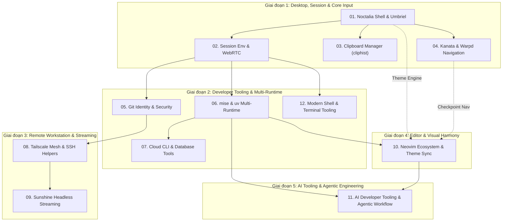

# Master Plan: Lộ trình Nâng cấp Hệ sinh thái Dotfiles Workstation

Tài liệu này tổng hợp toàn bộ lộ trình triển khai 11 kế hoạch hành động chi tiết, được xây dựng dựa trên [FEATURE-ECOSYSTEM-AUDIT.md](file:///home/loc/Workspaces/dotfiles/FEATURE-ECOSYSTEM-AUDIT.md). Thứ tự đánh số từ `01` đến `11` đại diện cho thứ tự ưu tiên phụ thuộc kỹ thuật: kế hoạch trước làm nền tảng cho kế hoạch sau.

---

## 1. Sơ đồ phụ thuộc kỹ thuật (Execution Graph)

---

## 2. Danh mục 12 Kế hoạch Hành động Chi tiết

Mỗi kế hoạch đều tuân thủ cấu trúc chuẩn: **Tên chức năng**, **Mô tả chức năng** (bối cảnh, mục tiêu, cấu trúc file, packages), **Chi tiết cấu hình/triển khai**, **Hướng dẫn sử dụng thực tế** (phím tắt, lệnh CLI, workflow) và **Kiểm thử nghiệm thu**.

| Thứ tự | File Kế hoạch | Tên Chức năng & Trọng tâm | Trạng thái |
|:---:|---|---|:---:|
| **01** | [01-noctalia-desktop-shell-va-umbriel.md](file:///home/loc/Workspaces/dotfiles/plans/01-noctalia-desktop-shell-va-umbriel.md) | Khôi phục `modules/noctalia` (sửa broken symlink), quản lý Notification/OSD/Wallpaper native, hoàn thiện window rules & keybinds Umbriel | ✅ Đã hoàn thành |
| **02** | [02-session-environment-va-webrtc-screensharing.md](file:///home/loc/Workspaces/dotfiles/plans/02-session-environment-va-webrtc-screensharing.md) | Chuẩn hóa `~/.config/environment.d/` toàn cục, cờ Wayland Ozone & PipeWire WebRTC capturer cho Chrome, Slack, Lark | ⏳ Sẵn sàng |
| **03** | [03-clipboard-manager-cliphist.md](file:///home/loc/Workspaces/dotfiles/plans/03-clipboard-manager-cliphist.md) | Quản lý lịch sử clipboard Wayland qua `cliphist`, systemd user service, tích hợp Noctalia launcher và FZF | ⏳ Sẵn sàng |
| **04** | [04-kanata-kernel-keyboard-va-warpd-hint-navigation.md](file:///home/loc/Workspaces/dotfiles/plans/04-kanata-kernel-keyboard-va-warpd-hint-navigation.md) | Remapping phím tầng kernel (`kanata` home-row mods, tương thích Telex Fcitx5 Bamboo), tối ưu repeat delay/rate (180ms/50Hz) & điều khiển chuột bàn phím (`warpd` hint mode) | ⏳ Sẵn sàng |
| **05** | [05-git-identity-ssh-signing-va-security.md](file:///home/loc/Workspaces/dotfiles/plans/05-git-identity-ssh-signing-va-security.md) | Hoàn thiện `modules/git`, SSH `ed25519` commit signing, `git-credential-libsecret`, `includeIf`, `gitleaks` pre-commit | ⏳ Chờ 02 |
| **06** | [06-mise-va-uv-runtime-management.md](file:///home/loc/Workspaces/dotfiles/plans/06-mise-va-uv-runtime-management.md) | Thay thế NVM bằng `mise` quản lý Node, Python, Rust, Go, IaC; kết hợp `uv` quản trị môi trường Python siêu tốc | ⏳ Chờ 02 |
| **07** | [07-cloud-aws-gcp-va-database-cli.md](file:///home/loc/Workspaces/dotfiles/plans/07-cloud-aws-gcp-va-database-cli.md) | Bộ công cụ AWS SSO (`granted`), GCP ADC, OpenTofu và Universal Database CLI (`usql`, `pgcli`, `iredis`) | ⏳ Chờ 06 |
| **08** | [08-tailscale-mesh-network-va-remote-helpers.md](file:///home/loc/Workspaces/dotfiles/plans/08-tailscale-mesh-network-va-remote-helpers.md) | Mạng riêng ảo Tailscale Mesh, Tailscale SSH, MagicDNS, SSHFS helpers (`ssh-mount`, `ssh-sync`) và Mosh | ⏳ Chờ 05 |
| **09** | [09-sunshine-headless-remote-desktop.md](file:///home/loc/Workspaces/dotfiles/plans/09-sunshine-headless-remote-desktop.md) | Remote desktop máy trạm độ trễ thấp với Sunshine (GPU encoder, HDMI Dummy Plug 4K) qua Tailscale IP nội bộ | ⏳ Chờ 08 |
| **10** | [10-neovim-ecosystem-va-dong-bo-theme-noctalia.md](file:///home/loc/Workspaces/dotfiles/plans/10-neovim-ecosystem-va-dong-bo-theme-noctalia.md) | Xây dựng `modules/nvim` hoàn chỉnh (Lazy.nvim, Mason LSP, `flash.nvim`) và đồng bộ theme toàn hệ thống qua Noctalia | ⏳ Chờ 04, 06 |
| **11** | [11-ai-developer-tooling-va-agentic-workflow.md](file:///home/loc/Workspaces/dotfiles/plans/11-ai-developer-tooling-va-agentic-workflow.md) | Hệ sinh thái AI Engineering: AG Kit, Ponytail YAGNI, RTK Ultra token compression, Caveman mode, CodeGraph MCP & Codebase MCP | ⏳ Chờ 06, 10 |
| **12** | [12-modern-shell-terminal-va-cli-ecosystem.md](file:///home/loc/Workspaces/dotfiles/plans/12-modern-shell-terminal-va-cli-ecosystem.md) | Terminal Workstation: Lazydocker, Bat, Superfile, Git-Delta, Resource Monitoring (btm/dust/duf) & Data CLI | ⏳ Sẵn sàng |

---

## 3. Nguyên tắc thực thi chuẩn (Engineering Standard)

1. **YAGNI & Tối giản (Ponytail Principle):** Sử dụng các tính năng nền tảng sẵn có (ví dụ Noctalia native notification thay vì cài thêm mako/swaync; HDMI dummy plug thay vì viết virtual driver phức tạp).
2. **Không commit Secret:** Mọi cấu hình cá nhân hoặc nhạy cảm đưa vào `.gitconfig.local` và `.zshrc.local` (đã nằm trong `.gitignore`), bảo vệ tự động bằng `gitleaks`.
3. **Thử nghiệm từng bước:** Mỗi plan sau khi thực thi đều có lệnh kiểm tra nghiệm thu (Verification Checklist) rõ ràng trước khi chuyển sang plan tiếp theo.
