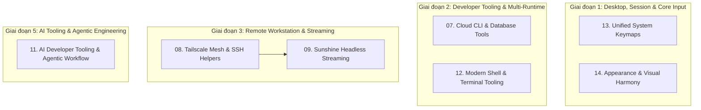

# Master Plan: Lộ trình Nâng cấp Hệ sinh thái Dotfiles Workstation

Tài liệu này tổng hợp toàn bộ lộ trình triển khai các kế hoạch hành động chi tiết cho hệ sinh thái Dotfiles Workstation. Thứ tự đánh số đại diện cho thứ tự ưu tiên phụ thuộc kỹ thuật: kế hoạch trước làm nền tảng cho kế hoạch sau.

---

## 1. Sơ đồ phụ thuộc kỹ thuật (Execution Graph)

---

## 2. Danh mục 7 Kế hoạch Hành động Chi tiết

Mỗi kế hoạch đều tuân thủ cấu trúc chuẩn: **Tên chức năng**, **Mô tả chức năng** (bối cảnh, mục tiêu, cấu trúc file, packages), **Chi tiết cấu hình/triển khai**, **Hướng dẫn sử dụng thực tế** (phím tắt, lệnh CLI, workflow) và **Kiểm thử nghiệm thu**.

| Thứ tự | File Kế hoạch | Tên Chức năng & Trọng tâm | Trạng thái |
|:---:|---|---|:---:|
| **07** | [07-cloud-aws-gcp-va-database-cli.md](file:///home/loc/Workspaces/dotfiles/plans/07-cloud-aws-gcp-va-database-cli.md) | Bộ công cụ AWS SSO (`granted`), GCP ADC, OpenTofu và Universal Database CLI (`usql`, `pgcli`, `iredis`) | ⏳ Sẵn sàng |
| **08** | [08-tailscale-mesh-network-va-remote-helpers.md](file:///home/loc/Workspaces/dotfiles/plans/08-tailscale-mesh-network-va-remote-helpers.md) | Mạng riêng ảo Tailscale Mesh, Tailscale SSH, MagicDNS, SSHFS helpers (`ssh-mount`, `ssh-sync`) và Mosh | ⏳ Sẵn sàng |
| **09** | [09-sunshine-headless-remote-desktop.md](file:///home/loc/Workspaces/dotfiles/plans/09-sunshine-headless-remote-desktop.md) | Remote desktop máy trạm độ trễ thấp với Sunshine (GPU encoder, HDMI Dummy Plug 4K) qua Tailscale IP nội bộ | ⏳ Chờ 08 |
| **11** | [11-ai-developer-tooling-va-agentic-workflow.md](file:///home/loc/Workspaces/dotfiles/plans/11-ai-developer-tooling-va-agentic-workflow.md) | Hệ sinh thái AI Engineering: AG Kit, Superpowers, Ponytails, UI/UX Pro Max, Graphify, Caveman, Addy Osmani, Understand Anything, Archify & Impeccable | ⏳ Sẵn sàng |
| **12** | [12-modern-shell-terminal-va-cli-ecosystem.md](file:///home/loc/Workspaces/dotfiles/plans/12-modern-shell-terminal-va-cli-ecosystem.md) | Terminal Workstation: Lazydocker, Bat, Superfile, Git-Delta, Resource Monitoring (btm/dust/duf) & Data CLI | ⏳ Sẵn sàng |
| **13** | [13-unified-system-keymaps-va-shortcuts.md](file:///home/loc/Workspaces/dotfiles/plans/13-unified-system-keymaps-va-shortcuts.md) | Hệ thống Phím tắt Toàn cục: Umbriel Window Nav, Zellij Split, Modal Editor, Kanata Dual-role & Warpd Mouse | ⏳ Sẵn sàng |
| **14** | [14-appearance-scaling-fonts-va-visual-harmony.md](file:///home/loc/Workspaces/dotfiles/plans/14-appearance-scaling-fonts-va-visual-harmony.md) | Quản trị Giao diện & Hiển thị: Wayland Display Scale, UI Scale 0.9, Fontconfig JetBrains Mono, Cursor 24px & GTK/Qt Dark Mode | ⏳ Sẵn sàng |

---

## 3. Nguyên tắc thực thi chuẩn (Engineering Standard)

1. **YAGNI & Tối giản (Ponytail Principle):** Sử dụng các tính năng nền tảng sẵn có (ví dụ Noctalia native notification thay vì cài thêm mako/swaync; HDMI dummy plug thay vì viết virtual driver phức tạp).
2. **Không commit Secret:** Mọi cấu hình cá nhân hoặc nhạy cảm đưa vào `.gitconfig.local` và `.zshrc.local` (đã nằm trong `.gitignore`), bảo vệ tự động bằng `gitleaks`.
3. **Thử nghiệm từng bước:** Mỗi plan sau khi thực thi đều có lệnh kiểm tra nghiệm thu (Verification Checklist) rõ ràng trước khi chuyển sang plan tiếp theo.
