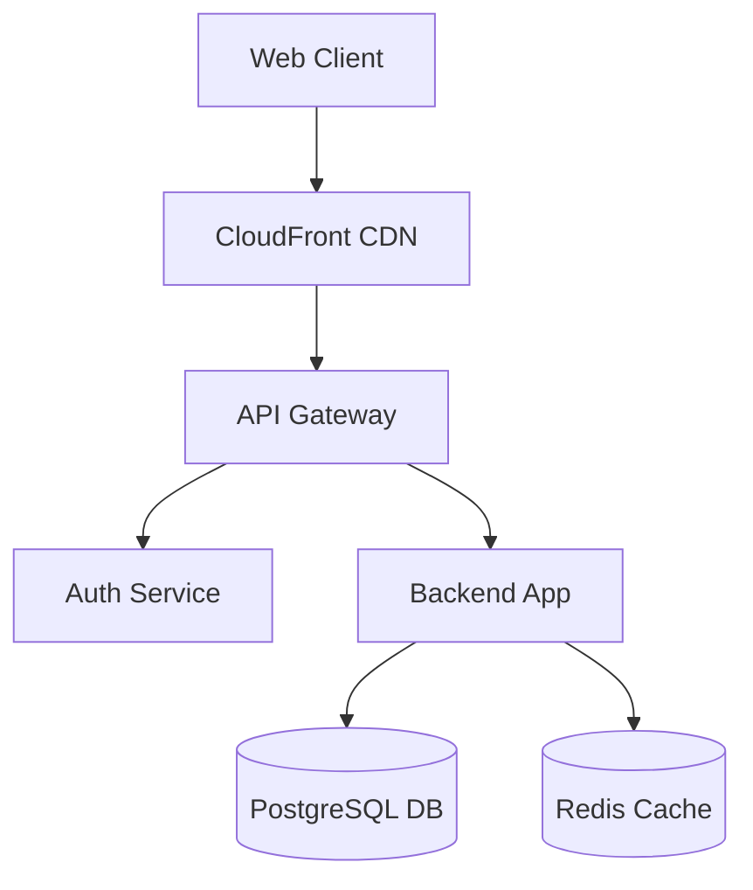
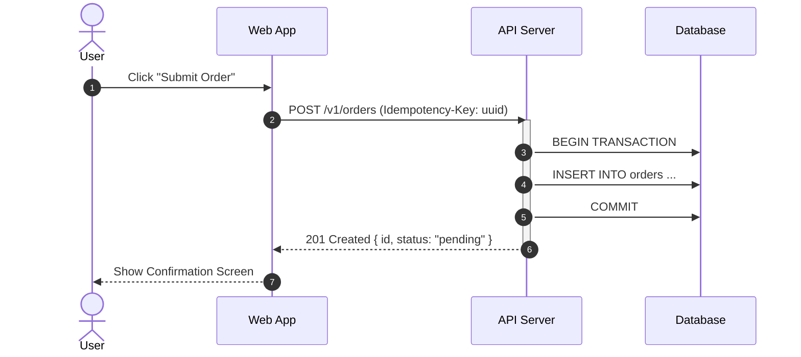
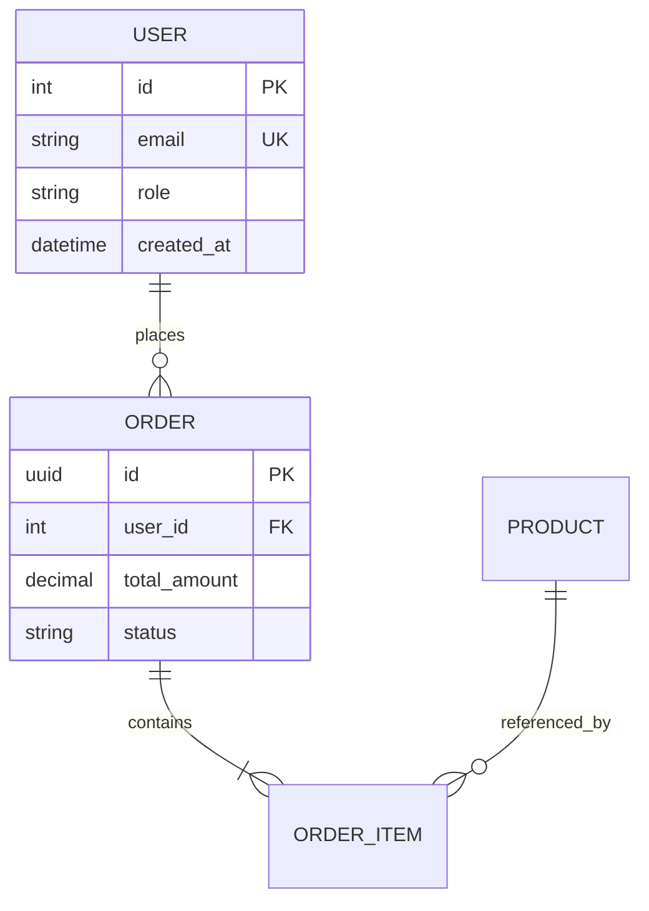

# Mermaid.js Diagram Guide

Standard syntax reference for markdown-rendered diagrams.

---

## 1. Flowcharts & Topologies

```mermaid
flowchart TD
    Client["Web Client"] --> CDN["CloudFront CDN"]
    CDN --> API["API Gateway"]
    API --> Auth["Auth Service"]
    API --> Backend["Backend App"]
    Backend --> Postgres[("PostgreSQL DB")]
    Backend --> Redis[("Redis Cache")]
```

## 2. Sequence Diagrams

```mermaid
sequenceDiagram
    autonumber
    actor User
    participant Client as Web App
    participant API as API Server
    participant DB as Database

    User->>Client: Click "Submit Order"
    Client->>API: POST /v1/orders (Idempotency-Key: uuid)
    activate API
    API->>DB: BEGIN TRANSACTION
    API->>DB: INSERT INTO orders ...
    API->>DB: COMMIT
    API-->>Client: 201 Created { id, status: "pending" }
    deactivate API
    Client-->>User: Show Confirmation Screen
```

## 3. Entity Relationship (ER) Diagrams

```mermaid
erDiagram
    USER ||--o{ ORDER : places
    ORDER ||--|{ ORDER_ITEM : contains
    PRODUCT ||--o{ ORDER_ITEM : referenced_by

    USER {
        int id PK
        string email UK
        string role
        datetime created_at
    }

    ORDER {
        uuid id PK
        int user_id FK
        decimal total_amount
        string status
    }
```
