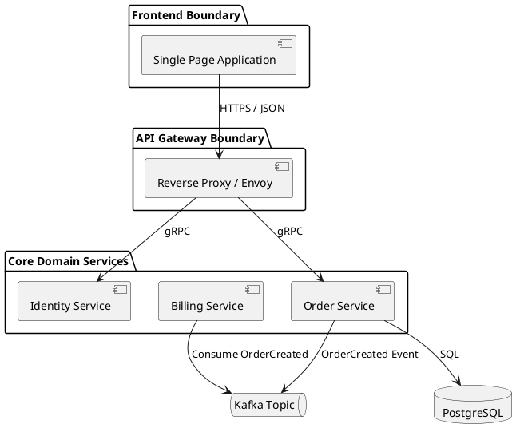
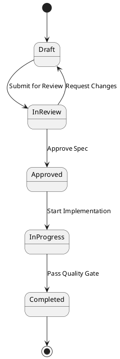

# PlantUML Guide

Standard component and deployment diagram patterns.

---

## 1. Component Diagrams

```plantuml
@startuml
skinparam componentStyle uml2

package "Frontend Boundary" {
  [Single Page Application] as SPA
}

package "API Gateway Boundary" {
  [Reverse Proxy / Envoy] as Gateway
}

package "Core Domain Services" {
  [Identity Service] as Auth
  [Billing Service] as Billing
  [Order Service] as Orders
}

database "PostgreSQL" as DB
queue "Kafka Topic" as Bus

SPA --> Gateway : HTTPS / JSON
Gateway --> Auth : gRPC
Gateway --> Orders : gRPC
Orders --> DB : SQL
Orders --> Bus : OrderCreated Event
Billing --> Bus : Consume OrderCreated
@enduml
```

## 2. State Machine Diagrams

```plantuml
@startuml
[*] --> Draft

Draft --> InReview : Submit for Review
InReview --> Draft : Request Changes
InReview --> Approved : Approve Spec
Approved --> InProgress : Start Implementation
InProgress --> Completed : Pass Quality Gate
Completed --> [*]
@enduml
```
